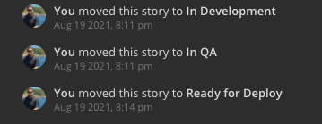

<p align="center">
  
</p>

<p align="center">
  <a href="https://github.com/zentered/shortcut-move-ticket-action/actions/workflows/test.yml"></a>
  <a href="https://github.com/zentered/shortcut-move-ticket-action/actions/workflows/publish.yml"></a>
  <a href="https://semantic-release.gitbook.io/semantic-release/"></a>
  <a href="https://conventionalcommits.org"></a>
  <a href="https://zentered.co">-Zentered-lightgrey?style=flat" /></a>
</p>

# Shortcut Move Story Action

Shortcut.com (previously Clubhouse.io) is a project management solution that has
a GitHub integration. The workflows are somewhat limited, this Action helps with
that. At the moment, the Action can be configured to move a Shortcut Story from
state "In Development" to "Ready for Quality Assurance" to "Ready for
Development" (the names are arbitrary, just to give an example).

You can configure a "gatekeeper" who is responsible for the state changes. If:

- the gatekeeper is "assigned for review" on a pull reuqest, the story will be
  moved to "review state"
- the gatekeeper approves the pull request, the story will be moved to "ready
  state"

The Action requires the Shortcut state IDs and the gatekeeper GitHub login to
work, as well as a
[Shortcut API Token](https://shortcut.com/api/rest/v3#Authentication).

## Table of Contents

- [Usage](#usage)
- [Inputs](#inputs)
- [Outputs](#outputs)

## Usage

You need to add the Shortcut API Token to the "Repository Secrets", which you
can find in the Settings. The Action listens on the events `pull_request` and
`pull_request_review`. The review and ready state IDs can be obtained from
Shortcut directly, they're typically 9-digit numbers. The "gatekeeper" is the
GitHub login name of the person responsible for approving the new state:

```yaml
name: shortcut-move

on:
  pull_request:
    types: [review_requested]
  pull_request_review:
    types: [submitted]

jobs:
  move:
    runs-on: ubuntu-latest
    steps:
      - uses: actions/checkout@v2
      - uses: actions/setup-node@v2.4.0
        with:
          node-version: 12
      - name: Shortcut Move
        uses: zentered/shortcut-move-ticket-action@v1.0.0
        with:
          shortcut_story_prefix: 'ch'
          shortcut_review_state_id: 100000001
          shortcut_ready_state_id: 100000002
          github_gatekeeper: 'Product-Manager'
        env:
          GITHUB_TOKEN: ${{ secrets.GITHUB_TOKEN }}
          SHORTCUT_TOKEN: ${{ secrets.SHORTCUT_TOKEN }}
```

## Inputs

| Name                       | Requirement | Default | Description                       |
| -------------------------- | ----------- | ------- | --------------------------------- |
| `shortcut_story_prefix`    | required    | ch      | Shortcut story prefix             |
| `shortcut_review_state_id` | required    | -       | ID of the "Review State"          |
| `shortcut_ready_state_id`  | required    | -       | ID of the "Ready State"           |
| `github_gatekeeper`        | required    | -       | GitHub Username of the Gatekeeper |

## Outputs



## Contributing

See [CONTRIBUTING](CONTRIBUTING.md).

## License

See [LICENSE](LICENSE).
